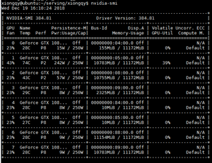
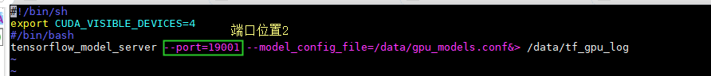

# 1 引言
## 1.1 目的和范围
将pb模型挂载，便于其他工程直接调用。

## 1.2 文档约定


# 2 环境要求

1. 本地已经安装如下程序：
    - docker
    - docker-compose
    - nvidia-docker

2. 本地已经加载以下镜像 ```sudo docker images```：
    - proxima/tf_serving_gpu:v2.01
    - proxima/tf_serving_cpu:v2.01


# 3 挂载流程
## 3.1 将模型拷贝到待挂载目录

```bash
cd demo/gpu_models
```

将自己的模型文件夹（包含pb模型）放到相应的文件夹下。并在文件“gpu_models.conf”中添加对应的模型。如下图所示：

 |  |  
:-: | :-: | :-: 
Fig 1 demo目录 | Fig 2 gpu_model目录 | Fig 3 gpu_models.conf文件

当前已经放了一个"detector_3d"模型文件夹。

## 3.2 修改entrypoint.sh文件

在服务器上，通过nvidia-smi命令查看gpu的使用情况，找出相对空闲的服务器。
通过更改entrypoint文件的指定服务器，将启用该服务器的模型改为该gpu名称。

<p align="center">
    
    <br>
    <div align="center">Fig 4 查看gpu使用情况</div>
</p>

## 3.3 执行挂载

### 3.3.1 运行指令挂载：

```bash
cd ..
sudo docker-compose -f tfserving_all.yml up    #开启gpu、cpu两个serving
sudo docker-compose -f tfserving_gpu.yml up    #只开启gpu单个serving（调试时推荐）
sudo docker-compose -f tfserving_gpu.yml up -d #只后台开启gpu单个serving（运行时推荐）
```

<p align="center">
    
    <br>
    <div align="center">‘sudo docker-compose -f tfserving_gpu.yml up’运行结果</div>
</p>

备注：如果出现端口或者container名称重复，需要自己进行修改，修改位置如下：

 |  
:-: | :-: 
tfserving_gpu.yml文件 | gpu_models/entrypoint.sh文件 

### 3.3.2 检测是否挂载成功：

通过文件夹中的tf log察看启动成功没

```bash
tail -f gpu-models/tf_gpu_log
```

如果成功则会看见最后一行为 Running ModelServer at 0.0.0.0:19001 ...


<p align="center">
    
    <br>
    <div align="center">日志结果</div>
</p>

# 4 参考文件
