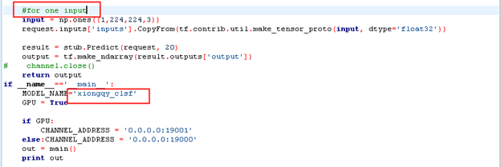
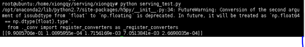

# 1 引言
## 1.1 目的和范围
使用python脚本检查模型是否正常调用。

## 1.2 文档约定


# 2 环境要求

1. 完成模型加载
2. 本地有python环境，并安装以下第三方库：
    - grpc
    - numpy
    - tensorflow
    - tensorflow_serving

# 3 测试流程
## 3.1 修改文件serving_test.py
测试serving_test.py。此处需要根据自己的输入调整一下py文件里的输入。模型调节主要分为input和model_name两个部分。 按照自己input的数量调整自己的输入，在model_name部分，将模型的名称调整为之前在config文件中写的文件名称。

<p align="center">
    
    <br>
    <div align="center">Fig 1 修改脚本</div>
</p>

备注：需要在本地运行，如果在开发docker环境，需要将address改为相应的ip地址。

## 3.2 运行脚本
运行脚本，测试serving是否成功。

```bash
sudo python3 serving_test.py
```

<p align="center">
    
    <br>
    <div align="center">Fig 2 运行脚本</div>
</p>

# 4 参考文件
