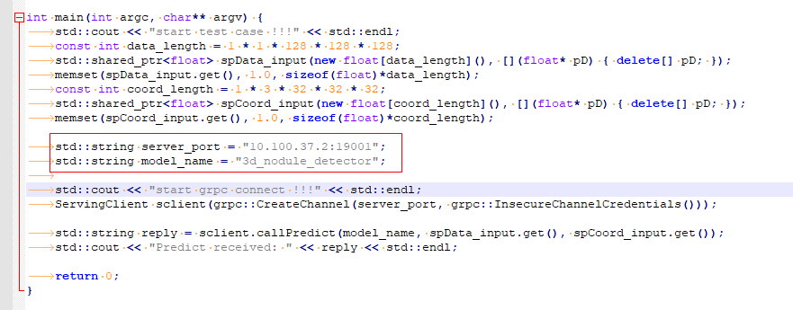
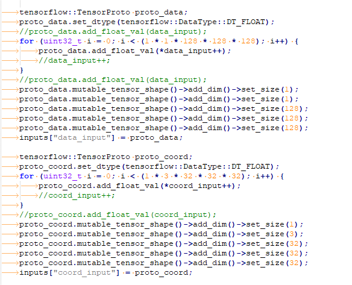
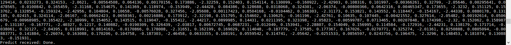

# 1 引言
## 1.1 目的和范围
使用cpp脚本检查模型是否正常调用。

## 1.2 文档约定


# 2 环境要求

1. 完成模型加载
2. 本地有以下第三方库：
    - tensorflow
    - tensorflow_serving

推荐：镜像```alpha-prod:1.3```及以上版本

# 3 测试流程

## 3.1 修改文件ServingTest.cpp

文件位置：“2_model_transfer/4_cpp_check/demo/ServingTest/ServingTest.cpp”

 |  
:-: | :-: 
Fig 1 main函数 | Fig 2 callPredict函数 

如上图所示，需要注意两点

    - 如Fig1，修改server_port和model_name，必须和挂载时一致
    - 如Fig2，修改输入数据维度

## 3.2 生成可执行程序

```bash
mkdir build
cd build
cmake ..
make
```
可以在当前BIN目录下找到可执行文件```ServingTestUT```

## 3.2 运行程序

```bash
./ServingTestUT
```

结果如下所示：

<p align="center">
    
    <br>
    <div align="center">Fig 3 运行结果</div>
</p>


# 4 参考文件
